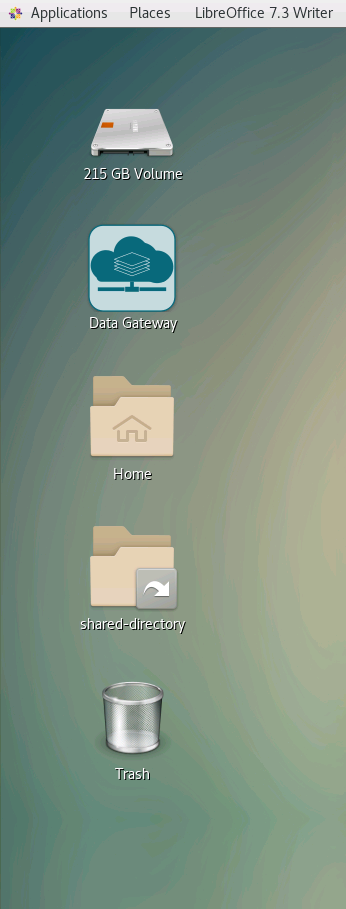
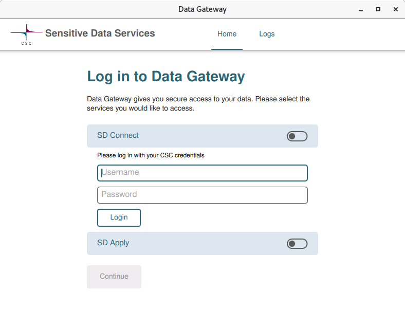
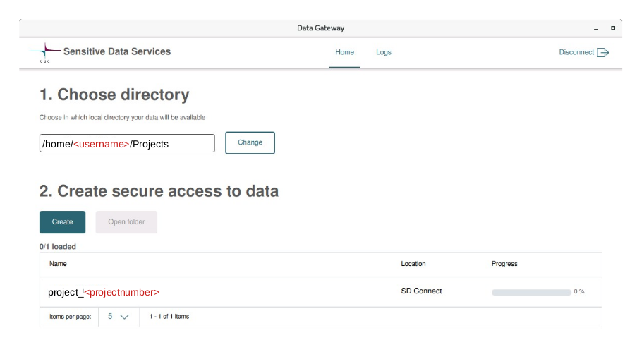
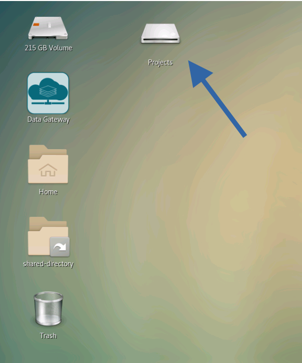
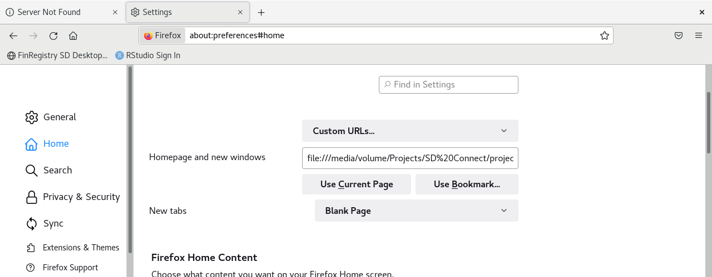

```{r setup, include=FALSE}
knitr::opts_chunk$set(echo = FALSE)

library(tidyverse)
library(DT)
library(reticulate)

# switch to Word document ####
#FinRegistry2master.Rmd
#  word_document:
#    reference_docx: doc_template.docx
# hash out ####
#library(DT)
#datatable(tmp)
# change sections to subsections ####
# replace # with ##
# add spacing before each sections ####
#<br/>
# resize images 1 and 4
# sd_desktop.png 15%
# sd_connect3.png 20%
```

<br/>
**Note:**
This manual is still in early development. Please contact the data manager for any enquiries not covered in this manual or if you want to add something.

Dr. Joanne Demmler <br/>
Email: joanne.demmler@helsinki.fi

<br/>

# Working with SD Desktop

CSC SD Desktop is a secure virtual environment for working with sensitive data. It is designed to make it easier for researchers to work with the data as it provides a graphical interface (CentOS 7 Linux) and provides read-only access to pre-processed data. You can find a description of the system and detailed instructions on the CSC website.

FinRegistry users can apply for a SD Desktop project by following the following steps (instructions with images can also be found [here](https://docs.google.com/presentation/d/1Q4tAchU1IoFJe70UMXs7ljwOpjnGbszB/edit?usp=sharing&ouid=112801058761494675377&rtpof=true&sd=true)):

**Note:** Links to external content will only work outside SD Desktop environment.

## Create a CSC account

  1. Go to [MyCSC](http://my.csc.fi/).
  2. Click Log in or Getting started.
  3. Click Virtu or Haka depending on which federation your home organization is a member of.
  4. Select your home organization and log in to their identity service.
  5. Fill in your information on the Sign up page.
  6. Set your password using 12 characters or more, containing both upper and lowercase letters and at least one number. No special characters are allowed.
     
You will receive your CSC user account information via email. 

## Setup multi-factor authentication on your phone

First, install a multi-factor authentication app on your mobile phone if you don’t already have one (for example Google Authenticator or Microsoft Authenticator).

In [MyCSC](http://my.csc.fi/) go to:

* My Profile (top right)
* Scroll down to [multi-factor authentication](https://docs.csc.fi/accounts/mfa/ )
* Click “activate”
* Log into Haka again
* Scan the provided QR code with an authenticator app on your phone

## Request a new FinRegistry SD Desktop project

Contact  [Joanne](mailto:joanne.demmler@helsinki.fi) to set up a new SCS project with the following information

* Project name
* Project description
   * about 300 words on what it is about and what you are trying to achieve in the project

You will either be given a medium or large virtual desktop, but more machines can be added later.

* Type and number of machines (i.e. 6-8 people can share one machine)
   * Medium: Core: 8; memory 30 GiB; Root disk: 80 GB
   * Large: Core: 40; memory 168 GiB; Root disk: 80 GB
* External memory (important for backup): 200 GB

You will receive a confirmation email with an invitation link one the virtual machines have been setup.

## Joining a project

  1. Your project manager will send you an invitation link:
  2. Click on emailed link invitation
  3. Click Apply project membership.

You will get another email telling you to accept the services:

* In [MyCSC](http://my.csc.fi/)
* Go to My Projects
* Go to the bottom right of the Page -> Services
* Confirm Allas and SD Desktop
   * there’s a little bell with an interrogation mark next to it
* You can now log out of MyCSC

## Working with the virtual desktop

Once your private virtual computer (Desktop) is launched, each CSC project member can securely access it from their browser at any time. Make sure you are connected to the University VPN network before accessing https://sd-desktop.csc.fi/guacamole/#/. You will need to use multi-factor authentication (e.g. Google or Microsoft authenticator to connect).

**Note:** If you are having problems connecting with the MFA, try clearing your browsing history first.

Scroll down to “ALL CONNECTIONS” and choose the virtual machine you want to connect to.

**Note:**
Never use the lock or reboot buttons in SD Desktop as you will not be able to connect to the Desktop again after that.

## Terms of use

Please make yourself familiar with terms of use https://research.csc.fi/general-terms-of-use and the current export restrictions due to Ukraine conflict:

Finnish law on export of dual use goods: https://www.finlex.fi/fi/laki/ajantasa/1996/19960562 
Part I of the Export Control list:  https://eur-lex.europa.eu/legal-content/EN/TXT/?uri=celex%3A32009R0428 
Restrictive measures of EU towards named individuals and business entities: https://eur-lex.europa.eu/eli/dec/2022/267/oj 


# About SD Desktop

## Overview

Where to find things:

```{r, echo=FALSE, out.width='30%'}

```

* Applications:
   * Start applications

* External Drive:
   * For backup of project data and documents by the project manager

* Data Gateway:
   * Mount SD Connect drive with sensitive data

* Shared-directory:
   * This is where all project data and software should be kept

Ctrl+C and Ctrl+V do not always work in this version of Linux, for example it won't work in the terminal. You can either use the right click of the mouse and select copy/paste or use Ctrl+Shift+C/V instead.

## Data Gateway

To connect to the sensitive data and additionally provided software you will have to launch the Data Gateway first (the shortcut is located in the top left of your screen).

Double click on “Data Gateway” and click on the switch symbol next to “SD Connect”. Now sign in with your CSC username and password:

```{r, echo=FALSE, out.width='70%'}

```

**Note:** You can ignore "SD Apply" for now.

Hit “Create” and then minimise this window. You will now see a new mounted drive called “Projects”


```{r, echo=FALSE, out.width='90%'}

```

```{r, echo=FALSE, out.width='40%'}

```

This is where all data and applications from SD Desktop reside. They are unencrypted on mount. Please note that the folder is read-only.

The Data Gateway can also be mounted over the command line with:

```
go-fuse -mount /media/volume/Projects
```

and closed with `Ctrl + C`.

## The external backup drive

It is really important to save the data on the external drive. If the desktop crashes and needs rebooting everything in the shared or personal folders will be lost, but the external drive is not affected from this. The path to the external drive is ` media/volume`.

I have set up the following structure on the external drive:

```
|-- admin
|  |-- documentation*
|  |  |-- images*
|  |-- scripts*
|  |-- encryption_keys
|-- bin
|-- users
|  |-- username
|-- data-out
|  |-- username

* these folder might only available within the FinRegistry admin project
```


## The shared directory

Files saved to the `shared-directory` are visible to other project members. The data structure is the same as on the external drive. You can backup your file/folder from the `shared-directory` over the command line like:

```
cp <filename> /media/volume/users/<username>
cp -R /<folder> /media/volume/users/<username>
```

The `bin` directory in the shared directory is for executing singularity files, i.e. these are extra apas, that are not pre-installed in with SD Desktop.


**Note:**
The “Shared” folder is specific to the virtual machine you are using. You won’t be able to see your files when logging into another machine unless to make them available on SD Connect.


## Help pages inside SD Desktop

We have prepared a shared document inside SD Desktop.

* Connect to the Data Gateway
* Got to 

```
Projects/SD\ connect/project_<projectnumber>/2004706_shared_admin_docs
```
   
   where **projectnumber** is your CSC project number

* Open `working-with-sd-desktop.html` (actually any of the html files will also work, but you will need to scroll to the top of the document before saving) in Firefox
* Set as the homepage
   * Open Application Menu (top right) 
   * Settings -> Home
   * Homepage and new windows
* You might also want to set new pages to be blank

The path will look like this:

```
file:///home/<username>/Projects/SD%20Connect/project_<projectnumber>/2004706_shared_admin_docs/working-with-sd-desktop.html
```

where **username** is your username and **projectnumber** is your project number.


```{r, echo=FALSE, out.width='70%'}

```


## Close your connection the SD Desktop

You can close your connection to your virtual Desktop in two ways:

Log out from your Desktop (in the workspace view, top right corner of the browser, select your username and log out). This will close all applications in your virtual Desktop and disconnect the work session. You will be able to access the virtual Desktop at any time after logging in to the services.

If you started a data analysis programmatically (you are running a script) you can close the browser window. This doesn't interfere with the processes running. Thus, when you reconnect to your Desktop, you have all your tools and interfaces still open and can continue working. However, remember to log out from the Desktop once the analysis is finished. If you leave more than ten connections open, you will be unable to re-access the services.

**Reminder:**
Never use the lock or reboot buttons in SD Desktop as you will not be able to connect to the Desktop again after that...


# Applications
## Pre-installed applications  

The following applications are pre-installed:

* Installation matching the r-env-singularity/4.0.5 module on Puhti (R 4.0.5 + RStudio Server 1.4.1106, Bioconductor 3.12)
* 1000+ pre-installed R packages (versions available on Apr 20 2021)
* Intel® oneAPI Math Kernel Library (oneMKL)
* GIS software (PROJ, GDAL, SAGA)
* CUDA drivers
* TensorFlow (used with R TensorFlow back-end)
* Python 3.8.6
* Jupyter Notebook
* Libre Office

## R

### CRAN R

Command line R is currently not set up as a recognised command, but you could open it from inside the singularity from the command line like this:

a) Open the singularity

```
singularity shell /opt/r-env-singularity/r-env-sdd.sif
```

The terminal output it now preceded with `Singularity >`.

b) Now open R

```
R
```

at the end of the session close R with `quit()`or `q()`.

Then close the singularity with `exit`.

### R Studio

**Note:** 

<div style="color:red;">
R Studio Server currently only works for one person per machine. CSC are working on providing a different version for us soon, which will be based on R Studio Desktop and will then allow multiple users to access R Studio at the same time. For now, please decide which user works on which machine. If several R users are sharing the same machine, make sure to close R properly and clear the temporary files before logging out of SD Desktop. See [6.2](#r-rm-tmp).
</div>

* Open the command line (Applications → System Tools → Terminal)
* Connect to R with

  ```
  start-rstudio-server
  ```

You will see something like this:

```
RStudio Server - Sensitive Data Desktop Edition
---------------------------------------------------------------------------------------
Copy/Paste this URL into Firefox:

http://localhost:8787/

-----------------------------------------------------------------------------------------
Enter these at the RStudio Server sign-in screen
----------------------------------------------------------------------------------------
Username: accountname  Password: Example23241232
----------------------------------------------------------------------------------------
To stop RStudio Server: Ctrl+C
```


* Copy the password (right click -> copy) and open Firefox
* Go to:

  ```
  http://localhost:8787/
  ```

* type in your username and password

**Tip:** You can bookmark this webpage [http://www.localhost:8787/auth-sign-in]() for later use, but you will need to use a different password with each connection!


### R packages

```{r}
tmp <- installed.packages()
tmp <- tmp %>% as.data.frame() %>% select("Package", "Version", "Built")
rownames(tmp) <- 1:nrow(tmp)
datatable(tmp)
#write.csv(tmp, "R_packages.csv", row.names=FALSE)
```

A list of the pre-installed R packages can be found [here](./R_packages.csv).

<br/>

Please contact Joanne if there are any packages missing and we will add them to the wishlist underneath.

**Package wishlist**

| Package       | Description                                              | Priority |
| -----         | -----                                                    | ----     |
| beepr         | Easily play notification sound on any platform           | medium   |
| coefplot      | Plots coefficients from fitted model                     | high     |
| flexdashboard | R markdown format for flexible dashboards                | low      |
| flextable     | Functions for tabular reporting                          | high     |
| gamlss        | Generalised additive models for location scale and shape | low      |
| gganimate     | A grammar of animated graphics                           | low      |
| ggvis         | Interactive grammar of graphics                          | low      |
| janitor       | Simple tools for examining and cleaning dirty data       | high     |
| jtools        | Analysis and presentation of social scientific data      | high     |
| pastecs       | Package for analysis of space-time ecological data       | medium   |
| summarytools  | Tools to quickly and neatly summarise data               | low      |
| survminer     | Drawing survival curves using ggplot2                    | high     |
| tmap          | Thematic maps                                            | high     |
| vtable        | Variable table for variable documentation                | low      |

 
### Using Python in R Studio

In R Studio go to Tools -> Global Options -> Python and select Python Interpreter.

To use Python Chunks in an R Markdown document load `library(reticulate)` and  use Python chunks, e.g.

```{r, child = "../python_verbatim.Rmd"}
```

## Python

### Command line Python

You can call the newest installed version of Python from the command line (Applications → System Tools → Terminal) with:

  ```
  python3.9
  ```


### Python via Jupyter Notebook

Open Jupyter Notebook (Applications -> Programming -> Jupyter Notebook)

Choose `Files -> New -> Python 3 (ipykernel)`


You can also open Jupyter notebook from the command line with:

```
jupyter notebook
```

or Jupyter-lab with:

```
jupyter-lab
```

### Python packages

```{python}
# import pkg_resources
# import pandas as pd
# installed_packages = pkg_resources.working_set
# installed_packages_list = sorted(["%s==%s" % (i.key, i.version)
#    for i in installed_packages])
# 
# df = pd.DataFrame (installed_packages_list, columns = ['column_name'])
```

```{r}
# tmp <- str_split(py$df$column_name, "==") %>% as.data.frame() %>% t() %>% # as.data.frame()
# rownames(tmp) <- 1:nrow(tmp)
# names(tmp) <- c("Package", "Version")
# datatable(tmp)
# write.csv(tmp, "py_packages.csv", row.names=FALSE)
```

```{r}

```

A list of the pre-installed Python packages can be found [here](./py_packages.csv).

Please contact Joanne if there are any packages missing and we will add them to the wishlist underneath.

**Package wishlist**

| Package       | Description                                              | Priority |
| -----         | -----                                                    | ----     |
|               |                                                          |          |


## Applications in singularity containers  

Other applications can be brought in with singularity containers via SD Connect.
They are then copied from SD Connect to `Desktop/shared-directory/bin` by the Data Manager to make them accessible to everyone in the project.
This also means that the data drive does not need to be mounted when working with these applications.

We are trialing this system at the moment, that's why you still need to call the full `singularity` command, but this will be made easier in the future.

Currently accessible applications are:

## QGIS

Check if QGIS singularity is in the `shared-directory/bin`. If not connect to the Data Gateway and copy it over:

```
cp Projects/SD\ Connect/project_<projectnumber>/sd_apps/qgis_plus.sif Desktop/shared-directory/bin/
```

where **projectnumber** is your project number.

QGIS can be started from the command line using

```
cd Desktop/shared-directory/bin
singularity exec -B $XDG_RUNTIME_DIR -B /shared-directory:/shared-directory $HOME/Desktop/shared-directory/bin/qgis_plus.sif qgis
```

You can create a shortcut like this:

```
# change directory
cd Desktop/shared-directory/bin/
# create script
cat >> run-qgis <<EOF
singularity exec -B $XDG_RUNTIME_DIR -B /shared-directory:/shared-directory $HOME/Desktop/shared-directory/bin/qgis_plus.sif qgis
EOF
# make executable
chmod u+x run-qgis
```

After this you can execute the shortcut like this:

```
cd Desktop/shared-directory/bin
./run-qgis
```

## Conda

Check if Conda singularity is in the `shared-directory/bin`. If not connect to the Data Gateway and copy it over:

```
cp Projects/SD\ Connect/project_<projectnumber>/sd_apps/conda_py3.9.sif Desktop/shared-directory/bin/
```

where **projectnumber** is your project number.

Conda can be started from the command lines using

```
cd Desktop/shared-directory/bin
singularity exec -B /shared-directory:/shared-directory $HOME/Desktop/shared-directory/bin/conda_py3.9.sif conda <+ conda options>
```

## PostgreSQL

Check if Postgres singularity is in the `shared-directory/bin`. If not connect to the Data Gateway and copy it over:

```
cp Projects/SD\ Connect/project_<projectnumber>/sd_apps/postgres_221102.sif Desktop/shared-directory/bin/
```

where **projectnumber** is your project number.


### Start Postgres

<div style="color:red;">
We are currently testing the database in the Kanta lab values project on the KantalabXL machine.
</div>

The database manager is responsible for launching the database and adding users. So please check with Joanne if you want to be added as a user. In the second one connect to the database:

You can launch the database from the command line:

```
cd Desktop/shared-directory/bin
singularity exec postgres_221102.sif psql -h localhost -p 5432 -d FINREGISTRY
```

You can create a shortcut like this:

```
# change directory
cd Desktop/shared-directory/bin/
# create script
cat >> run-psql <<EOF
cd Desktop/shared-directory/bin
singularity exec postgres_221102.sif psql -h localhost -p 5432 -d FINREGISTRY
EOF
# make executable
chmod u+x run-psql
```

After this you can execute the shortcut like this:

```
cd Desktop/shared-directory/bin
./run-psql
```

### Some Postgres short commands

| Command             | Description                                |
| ----                | -----                                      |
| \\dt                | list all available tables                  |
| \\d **table_name ** | describe a table with name **table_name**  |
| \\dn                | list available schemata                    |
| \\df                | list available functions                   |
| \\du                | list users and their roles                 |
| \\e                 | edit SQL command in editor                 |
| \\ef                | edit a function in editor                  |
| \\q                 | quit postgres                              |


# Data  

Once the Data Gateway is mounted, the path to the data is:

```
cd Projects/SD\ Connect/project_<projectnumber>/
```

where **projectnumber** is your CSC project number.


## Open Data

Currently available Open Data:

| Dataset                                                    | Name on SD Connect                      | Source                                                              |
| -----                                                      | -----                                   | ----                                                                |
| OpenStreetMap data Finland                                 | OpenStreetMap_Finland                  | https://download.geofabrik.de/europe/finland.html                   |
| Paavo – Open data by postal code area                      | Paavo_postcodes               | SF [Open geographic data](https://www.stat.fi/org/avoindata/paikkatiedoaineistot_en.html) Geoserver: https://geo.stat.fi/geoserver/postialue/wfs          |
| Statistics Finland: Municipality-based statistical units   | Statistical_areas       | SF [Open geographic data](https://www.stat.fi/org/avoindata/paikkatiedoaineistot_en.html) Geoserver: https://geo.stat.fi/geoserver/tilastointialueet/wfs  |
| Population by municipality-based units                     | Municipality_Population             | SF [Open geographic data](https://www.stat.fi/org/avoindata/paikkatiedoaineistot_en.html) Geoserver: https://geo.stat.fi/geoserver/vaestoalue/wfs         |
| Grid net for statistics                                    | Population_grid            | SF [Open geographic data](https://www.stat.fi/org/avoindata/paikkatiedoaineistot_en.html) Geoserver: https://geo.stat.fi/geoserver/vaestoruutu/wfs        |


## Sensitive Data

You can ignore all folders ending in `segments`. These are created when uploading large data files.
You can also ignore any files ending in `_amenta`, which are log files for the data transport.

| Dataset                   | Name on SD Connect                     |
| -----                     | -----                                  |
| detailed_longitudinal     | detailed_longitudinal_20221115         |
| DVV                       | dvv_20221014                           |
| endpointers               | endpointer_20221112                    |
| endpointer metadata       | endpointer_metadata_20221014           |
| ETK pensions              | etk_pension_20221014                   |
| Intensive care            | ficc_intensive_care_20221014           |
| Minimal phenotype         | minimal_phenotype_20221014             |
| SF socioeconomic data     | sf_socioeconomic_20221112              |
| THL births                | thl_birth_20221014                     |
| THL cancer                | thl_cancer_20221014                    |
| THL infectious diseases   | thl_infectious_diseases_20221014       |
| THL malformations         | thl_malformations_20221014             |
| THL social assistance     | thl_social_assistance_20221014         |
| THL sosHILMO              | thl_soshilmo_20221014                  |
| THL vaccination           | thl_vaccination_20221018               |

# Requesting data out of SD Desktop

Your virtual desktop is isolated from the internet for security reasons. Only the CSC project manager (Joanne) can export results or data from the secure workspace. To get your data out of the virtual data it needs to be manually encrypted, push through the airlock back to SD Desktop and decrypted on the other end.

**Note:** 

<div style="color:red;">
CSC are currently working on an easier way to encrypt and push files through the airlock.
</div>

## Install the Crypt4GH application
**You only need to do this once!**

CSC has developed a simple application that will allow you to generate your encryption keys and decrypt files when necessary. Download the version specific to your operating system from the [GitHub repository](https://github.com/CSCfi/crypt4gh-gui/releases):

* [Linux](https://github.com/CSCfi/crypt4gh-gui/releases/download/v1.2.0/crypt4gh-gui-python3.8-linux-amd64.zip)
* [Mac](https://github.com/CSCfi/crypt4gh-gui/releases/download/v1.2.0/crypt4gh-gui-python3.8-macos-amd64.zip)
* [Windows](https://github.com/CSCfi/crypt4gh-gui/releases/download/v1.2.0/crypt4gh-gui-python3.8-windows-amd64.zip)
    
Please check that the tool for Windows has been digitally signed by CSC - IT Center for Science. After the download, you can find the Crypt4GH application in your downloads folder.

When you open the application for the first time, you might encounter an error message. In this case, click on More info and verify that the publisher is CSC-IT Center for Science (or Finnish CSC-Tieteen tietotekniikan keskus Oy) and then click on Run anyway.

## Generate your encryption keys
**You only need to do this once!**

* Open the Crypt4GH application and click on Generate Keys (on the top right corner).
* The tool will open a new window and ask you to insert a password (Private Key Passphrase). This password will be associated with your secret key. Please, use a strong password.
* When you click on OK, the tool will generate a key pair consisting of a secret key (your **username**_crypt4gh.key) and a public key (your **username**_crypt4gh.pub).
* The keys/file names will be displayed in the Activity Log with the following message:
    
Key pair has been generated, your private key will be auto-loaded the next time you launch this tool:

  Private key: **username**_crypt4gh.key   
  Public key: **username**_crypt4gh.pub

All the fields must be filled before file encryption will be started.

The keys will be generated and saved to the **same folder in which the application resides**.

**Note:**

* If you lose or forget your secret key or the password, you will be unable to decrypt the files.
* Do not share your secret key or your password.
* You need to create your keys only once and use them for all your encryption needs, but you can of course, choose to generate separate keys for encryption as you wish.

## Upload your encryption key to SD Connect
**You only need to do this once!**

Open [SD Connect](https://sd-connect.csc.fi/) in your browser. In your project find the bucket encryption_keys and push your public key into it.

**Note:** We have not tested this yet, it might be that only the data manager can do this, so inform Joanne if it doesn’t work!

Connect to SD Desktop / Data Gateway and copy your encryption key to `Desktop/shared-directory/bin/encryption_keys`. You can do this manually or over the command line, i.e.:

```
cp Projects/SD\ connect/project_<projectnumber>/encryption_keys/<username>_crypt4gh.pub Desktop/shared-directory/bin/encryption_keys
```

where **projectnumber** is your CSC project number and **username** is your CSC username.

**Note:** Again, this needs testing and might have to be done by the data manager.


## Request your files out of SD Desktop

The following steps are required to successfully export any data from SD Desktop to SD Connect:

  1. Requester fills the [online form](https://elomake.helsinki.fi/lomakkeet/110781/lomakkeet.html) with the following information
      a. Full name
      b. Email
      c. Filename(s)
      d. Content of the file(s)

   If more than one file is to be exported, description for each and every file is required.  

  2. Requester needs to approve the following statement in the online form: “I certify that this file does not contain any individual-level data, but only aggregate data where the level of aggregation for each possible combination of variables is **N>=5** and submit application

  3. A copy of each application form is saved internally for bookkeeping purposes

  4. Approver (Dr. Demmler/ Dr. Ganna) receives an email notification of the export request

  5. Approver (Dr. Demmler/ Dr. Ganna) reviews the form and approves/disapproves the request

  6. Requester gets a confirmation by the Approver

  7. Encrypt all files and place them in 
  > Desktop/shared-directory/data-out/**username**
  where **username** is your CSC username.

This is done on the SD Desktop command line with:

```
# change to the location where the encryption keys are saved
cd Desktop/shared-directory/bin/encryption_keys
# encrypt each file
crypt4gh encrypt --recipient_pk <username>_crypt4gh.pub < <path>/<filename> > filename.c4gh
```

for example:

```
crypt4gh encrypt --recipient_pk smitha_crypt4gh.pub < mycode.txt > mycode.txt.c4gh
```

## Move data to SD Connect

This step is done by the project manager, i.e.

```
airlock-client <username> <foldername> filename.c4gh
```

where **username** is your username and **foldername** is the name of the folder on SD Connect you are sending the file to.

## Download and decrypt data (outside SD Desktop)

Once the data manager has approved your request it will be pushed through the airlock-client to SD Connect. The data manager will let you know when the file(s) is/are available.

You can then download the encryted file from [SD Connect](https://sd-connect.csc.fi/).

After download, you can decrypt the data using the Crypt4GH application and your secret encryption key. Unfortunately, it is currently not possible to decrypt more than one file at a time. However, CSC are working on adding this option and integrating it with the SD Connect user interface.

1. Open the Crypt4GH application and click on load Your Private Key.
2. Click on Select File and upload the file you want to decrypt.
3. Click on Open.
4. Next, click on Decrypt File.
5. The tool will ask you to write the secret key's password, press ok. Then, the file will be decrypted in the same location as the original file.

The secret key must match the public key used to encrypt the data in the decryption process. In the case of decryption, adding the public key is not mandatory, but if you have the public key of the person who has encrypted the file, you can use it to verify the encryption signature. If you don't select a public key, the activity log will display the following (the decryption will be executed anyway):

```
Sender public key has not been set, authenticity will not be verified.
```

# Q&A

## Getting help

The data and virtual machines are set up by the FinRegistry admin team. However, most technical problems will need to be forwarded to CSC: servicedesk@csc.fi (email subject Sensitive Data). Please include the project number in the email.

## Can't open application or Data Gateway

Some of my programmes or the Data Gateway have become unresponsive. What do I do?

This probably means that a previous connection the SD Desktop is still running, you will need to frin it’s process_number and kill the process manually on the command line

* Open the command line (Applications → System Tools → Terminal)
* Identify the process you need to kill
    
  **a) list all running processes**
  
  ```
  ps -edalf
  ```

	**b) select the process that hangs, i.e.**


	Data Gateway:
	
	```
	ps -edalf | grep bin/sdafuse | grep -v grep
	```
	
	Libre Office:
	
	```
	ps -edalf | grep soffice.bin | grep -v grep
	```
	
	Firefox browser:
	
	```
	ps -edalf | grep /usr/lib64/firefox/firefox | grep -v grep
	```
	
	RStudio Server:
	
	```
	ps -edalf | grep /usr/lib/rstudio-server/bin/rserver |  grep -v grep
	```

You can now kill the process using the process number (the number after your username)

  ```
  kill -9 12345
  ```

## System error X opening RStudio {#r-rm-tmp}

Various system errors when trying to run `start-rstudio-server`, for example:

 ```
 system error 7
 system error 98
 system error 13
 ```
 
 * check temporary files and which user has caused them:
 
   ```
   ls -la /tmp/var
   ```
 
 * this user has to remove their files with:
 
   ```
   rm -r /tmp/var
   ```
 